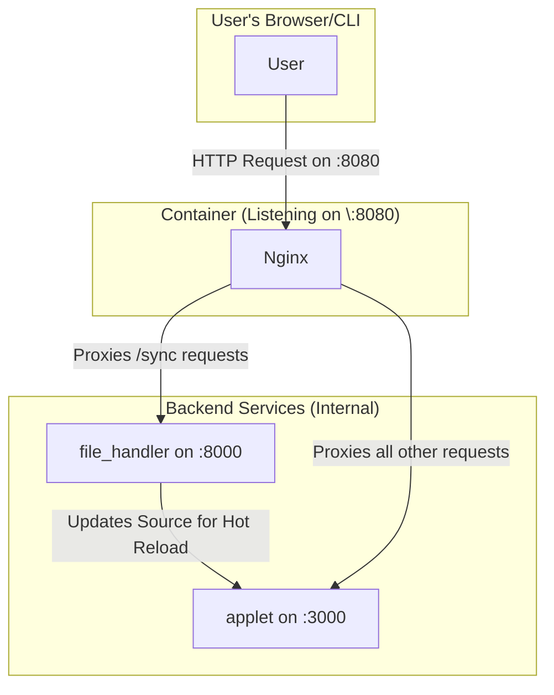

## Architecture



## Deploy The app

```bash
$ gcloud beta run deploy hot-reload --source . --region us-central1 --max 1
```


## Change a file and sync it to the container
```bash
# First, change the ./applet/app/api/hello/route.js file
$ curl -X POST http://localhost:8080/_sync \
   -H "Content-Type: application/json" \
   -d '{"/app/applet/app/api/hello/route.js": "'$(base64 -w 0 ./applet/app/api/hello/route.js)'"}'

$ curl -X POST http://localhost:8080/_sync \
   -H "Content-Type: application/json" \
   -d '{"/app/applet/app/page.js": "'$(base64 -w 0 ./applet/app/page.js)'"}'
```

```
